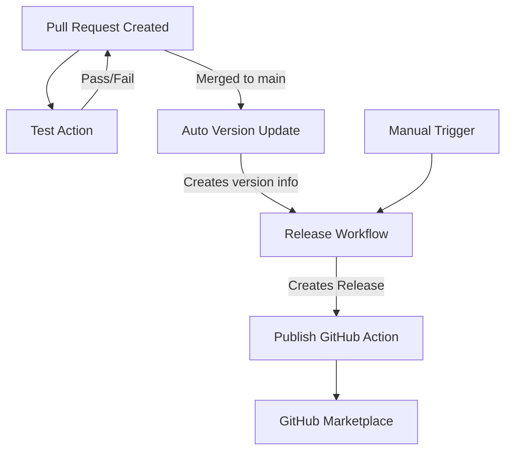

# CI/CD Workflows Documentation

This document provides detailed information about the GitHub Actions workflows used in this repository and how they work together to automate our release process.

## Workflow Overview

Our CI/CD pipeline consists of several interdependent workflows:



## Workflow Details

### 1. Test Action (`test.yml`)

**Purpose**: Verify that code changes don't break functionality.

**Triggers**:
- Push to repository with changes to source code or YML files
- Pull requests with changes to source code or YML files

**Key Features**:
- Matrix testing across Node.js versions
- Caching for faster builds
- Security audit of dependencies
- Self-test of the action on main branch

**Outputs**: Test results and build verification

### 2. Auto Version Update (`auto-version.yml`)

**Purpose**: Automatically determine and bump version number based on conventional commits when a pull request is merged.

**Triggers**: 
- When a pull request is merged to the main branch

**Key Features**:
- Uses [conventional-changelog-action](https://github.com/TriPSs/conventional-changelog-action) to analyze commits
- Determines version bump type (major, minor, patch) based on conventional commit messages
- Updates `package.json` version
- Creates artifact with version information for downstream workflows

**Version Bump Rules**:
- `fix:` commits → Patch bump (e.g., 1.0.0 → 1.0.1)
- `feat:` commits → Minor bump (e.g., 1.0.0 → 1.1.0)
- `BREAKING CHANGE:` or `feat!:` commits → Major bump (e.g., 1.0.0 → 2.0.0)

**Outputs**:
- `bump_type`: The type of version bump (major, minor, patch, none)
- `new_version`: The new version after bumping
- `should_release`: Flag indicating if a release should be created

### 3. Release Workflow (`release-workflow.yml`)

**Purpose**: Create a GitHub release based on the version update.

**Triggers**:
- After the Auto Version Update workflow completes
- Manual trigger with version choice

**Key Features**:
- Downloads version info artifact from auto-version workflow
- Builds the action code
- Creates a GitHub release with release notes
- Updates major and minor version tags

**Outputs**: GitHub release with appropriate tags

### 4. Publish GitHub Action (`publish.yml`)

**Purpose**: Finalize the action for GitHub Marketplace.

**Triggers**:
- When a release is created

**Key Features**:
- Runs tests to ensure everything works
- Builds the action using ncc
- Commits the `dist` directory to the repository
- Updates version tags for easy reference in workflows

## Using Conventional Commits

For automatic versioning to work correctly, commit messages should follow the [Conventional Commits](https://www.conventionalcommits.org/) specification:

```
<type>[optional scope]: <description>

[optional body]

[optional footer(s)]
```

Common types include:
- `feat`: A new feature (triggers minor version bump)
- `fix`: A bug fix (triggers patch version bump)
- `docs`: Documentation changes only
- `style`: Changes that do not affect the meaning of the code
- `refactor`: Code changes that neither fix a bug nor add a feature
- `perf`: Code changes that improve performance
- `test`: Adding or correcting tests
- `chore`: Changes to the build process or auxiliary tools

Breaking changes are denoted by:
- Adding `!` after the type/scope: `feat!: introduce breaking API change`
- Adding a footer with `BREAKING CHANGE`: `feat: new feature\n\nBREAKING CHANGE: existing API changed`

## Manual Release Process

Sometimes you may need to manually trigger a release:

1. Go to the Actions tab in the GitHub repository
2. Select the "Release Workflow"
3. Click "Run workflow"
4. Select the branch (usually main)
5. Choose the version bump type (patch, minor, major)
6. Click "Run workflow"

The workflow will then create a release with the specified version bump.

## Troubleshooting Common Issues

### Version Not Bumping

- Ensure your commit messages follow the conventional commits format
- Check if the PR was actually merged (not just closed)
- Verify that the files changed are not in the paths-ignore list

### Release Not Created

- Check if the auto-version workflow completed successfully
- Verify that the version-info artifact was created
- Check if the version already exists as a tag

### Build Failures

- Ensure all dependencies are correctly installed
- Verify that tests pass locally
- Check for syntax errors in the workflow files

## Best Practices

1. Always use conventional commit messages, especially for feature additions and bug fixes
2. When making breaking changes, be sure to indicate them properly in commit messages
3. For complex changes, use a PR description that clearly explains the changes
4. Test the action locally before pushing changes
